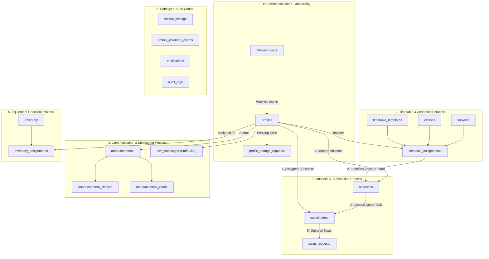

# Database Architecture & Entity Analysis Report

**System**: School Management System (SMS)  
**Database Provider**: Supabase (PostgreSQL)  
**Security Model**: PostgreSQL Row Level Security (RLS) with Role-Based Access Control (RBAC)  
**Generated Date**: August 14, 2026  

---

## 1. Executive Summary

- **Total Tables**: 23 Tables
- **Primary Schema**: `public`
- **User Roles**: Admin, Vice Principal, Sectional Head, Teacher
- **Core Workflows**: Teacher Absence Reporting, Automated Substitute Assignment, Class Timetable Management, Staff Announcements, Inventory Tracking.

---

## 2. Table Catalog (23 Tables)

| Subsystem | Table Name | Description | Key Foreign Keys |
| :--- | :--- | :--- | :--- |
| **Authentication & Users** | `profiles` | User accounts, roles, departments, contact info | References `auth.users(id)` |
| | `allowed_users` | Pre-approved email whitelist for teacher registration | — |
| | `profile_change_requests` | Profile edit requests pending admin approval | References `profiles(id)` |
| **Academics & Timetable** | `subjects` | School subjects and UI color mappings | — |
| | `classes` | Class/Grade definitions and class teacher assignments | References `profiles(id)` |
| | `timetable_templates` | Daily period structures and start/end times | — |
| | `schedule_assignments` | Central schedule mapping teacher, subject, class, period | References `profiles(id)`, `classes(id)`, `subjects(id)` |
| **Absence & Substitution** | `absences` | Teacher absence records and approval status | References `profiles(id)` |
| | `substitutions` | Substitute teacher cover assignments | References `absences(id)`, `profiles(id)` |
| | `swap_requests` | Cover period swaps between teachers | References `substitutions(id)`, `profiles(id)` |
| **Communication** | `announcements` | School broadcasts and notices | References `profiles(id)` |
| | `announcement_classes` | Target grade/class filter for notices | References `announcements(id)`, `classes(id)` |
| | `announcement_reads` | Notice read receipts per user | References `announcements(id)`, `profiles(id)` |
| | `hive_messages` | Real-time staff chat messages | References `profiles(id)` |
| **Inventory** | `inventory` | School equipment catalog (laptops, projectors, etc.) | — |
| | `inventory_assignments` | Equipment checkouts and return status | References `inventory(id)`, `profiles(id)` |
| **Settings & Logs** | `school_settings` | Global rules (14h absence cutoff, timezone) | — |
| | `school_calendar_events` | Academic calendar & public/Poya holidays | — |
| | `timetable_imports` | Audit log for bulk timetable Excel imports | References `profiles(id)` |
| | `notifications` | In-app user notifications | References `profiles(id)` |
| | `audit_logs` | System audit trail | References `profiles(id)` |
| | `calendar_sync_logs` | External holiday API sync log | — |
| | `calendar_audit_logs` | Audit trail for calendar changes | References `profiles(id)` |

---

### Deprecated & Removed Legacy Schema Artifacts

The following 7 table names from early design documents or initial migrations are unused by application code and have been documented/removed:
1. **`subjects`**: Dropped via migration `20260818000001_drop_unused_subjects_table.sql`. Subject lists/colors are stored directly on `profiles` (`subjects` text array, `subject_colors` jsonb) and `schedule_assignments.subject`.
2. **`notices`**: Non-existent in live database (`0` references in code). Replaced by `announcements`.
3. **`staff_chat`**: Non-existent in live database (`0` references in code). Replaced by `hive_messages`.
4. **`inventory_items`**: Non-existent in live database (`0` references in code). Replaced by `inventory`.
5. **`inventory_logs`**: Non-existent in live database (`0` references in code). Replaced by `inventory_assignments`.
6. **`school_calendar`**: Non-existent in live database (`0` references in code). Replaced by `school_calendar_events`.
7. **`class_subjects`**: Non-existent in live database (`0` references in code). Replaced by `schedule_assignments`.

---

## 3. Business Process & Database Entity Data Flow

---

## 4. How to Access & Analyze

1. **Supabase Web Console (Interactive ERD)**:
   - Dashboard: `Database` → `Schema Visualizer`
2. **Direct Connection String (For DBeaver / TablePlus / DataGrip)**:
   - Dashboard: `Project Settings` → `Database` → `Connection String (URI)`
3. **Migration SQL Source Files**:
   - Migration folder: `supabase/migrations/`
